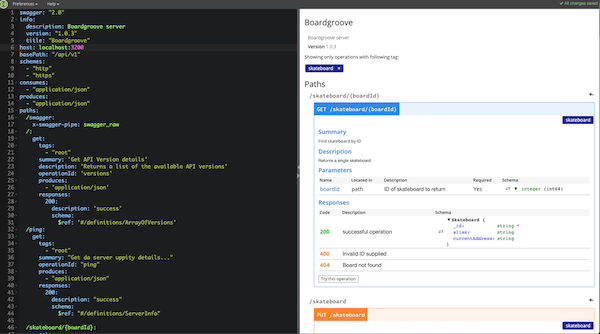

`````.______     ______        ___      .______       _______    _______ .______        ______     ______   ____    ____  _______ 
|   _  \   /  __  \      /   \     |   _  \     |       \  /  _____||   _  \      /  __  \   /  __  \  \   \  /   / |   ____|
|  |_)  | |  |  |  |    /  ^  \    |  |_)  |    |  .--.  ||  |  __  |  |_)  |    |  |  |  | |  |  |  |  \   \/   /  |  |__   
|   _  <  |  |  |  |   /  /_\  \   |      /     |  |  |  ||  | |_ | |      /     |  |  |  | |  |  |  |   \      /   |   __|  
|  |_)  | |  `--'  |  /  _____  \  |  |\  \----.|  '--'  ||  |__| | |  |\  \----.|  `--'  | |  `--'  |    \    /    |  |____ 
|______/   \______/  /__/     \__\ | _| `._____||_______/  \______| | _| `._____| \______/   \______/      \__/     |_______|
                                                                                                                             

                                          _             _   _____ 
                                          | |           | | / ____|
                         _ __    ___    __| |  ___      | || (___  
                        | '_ \  / _ \  / _` | / _ \ _   | | \___ \ 
                        | | | || (_) || (_| ||  __/| |__| | ____) |
                        |_| |_| \___/  \__,_| \___| \____/ |_____/ 
                                            
                                            
`````


In the shared mobility space, there are a number of different types of shared assets - cars, scooters, ebikes. For this project, we want to create a starting point for an API that will allow individual skateboarders to share their boards. 

- **Project Name:** Boardgroove REST API
- **Project Goal:** Create/define an API that will help skateboarders to share their 'boards'
- **Technology:** node.js, express, swagger, mocha, chai, mongo-mock for db
- **Deliverables:**  branch for this version is https://github.com/mbsoft/new_mob_assignments/tree/sample_js_nodejs
- **Time Spent:** approximate your time spent on the homework (i.e. 4.5 hrs)
 
**Task:** Build the REST API that might support the stories described above. Write unit tests for each component.

**Enhancement/Feature Request List**
- use this section to collect ideas for candidates to work on to extend the project

**Requirements:**

1. Design your API in a RESTful way and respond with JSON. - *done*
1. Make sure your code has tests. - *done*
1. Consider some form of logging - *done*
1. Write the code and design your system to be as realistic and production-ready as possible. Follow best-practices and focus on quality. - *meh*
1. A skateboards might have the following attributes: name of owner, brand, weight, length, location, timestamp and any other attribution you deem necessary - *done*
1. Add endpoints that support your solution - *done*
1. Bonus points for adding any kind of front-end that can be used to visualize available boards through use of the designed APIs - *partial (swagger ui)*
some examples:
 
  * **Create skateboards:**
*done*
    - attributes for a board might include the photo, dimensions, specs etc.
    - To keep things simple, no authentication needs to be performed. 
    - POST /api/v1/skateboard

  * **Get skateboards**
  *done*
    - perhaps based on status, spec filter etc.
    -GET /api/v1/skateboard  (returns all boards)   
    -GET /api/v1/skateboard/{boardId} (returns single board) 
  * **Update skateboards**
  *done*
    - change status, add additional details/specs etc.
    -PUT /api/v1/skateboard
  * **Delete skateboard**
  *done*
 
    -DELETE /api/v1/skateboard/{boardId}  

##Install
```$xslt
npm install
npm install -g swagger ' to user swagger UI interface
```
## Run
```$xslt
npm start

**or**
docker build .
docker run -p 127.0.0.1:3200:3200 <container_id>
```
## Interactive Test Using Swagger UI
```$xslt
swagger project edit

```


##Minimum unit test and coverage results

```javascript
npm test

> nyc --all --reporter=text mocha --recursive

{
  info: {
    name: 'Boardgroove',
    description: 'Boardgroove server',
    version: '1.0.3'
  },
  paths: {
    get: [
      '/',
      '/ping',
      '/api/v1/skateboard/:boardId',
      '/api/v1/skateboard'
    ],
    delete: [ '/api/v1/skateboard/:boardId' ],
    put: [ '/api/v1/skateboard' ],
    post: [ '/api/v1/skateboard' ]
  }
}
Express skipped binding while running test process


  GET all skateboards
    ✓ should return all skateboard records

  GET single skateboard
    ✓ should return a single skateboard record

  DELETE single skateboard
    ✓ should delete a single skateboard record

  POST new skateboard
    ✓ should add a new skateboard record

  UPDATE a skateboard
    ✓ should update a skateboard record

  GET api versions
    ✓ should return api version details

  GET ping status
    ✓ should return service status details


  7 passing (67ms)
  
---------------------------------------|---------|----------|---------|---------|-------------------
File                                   | % Stmts | % Branch | % Funcs | % Lines | Uncovered Line #s
---------------------------------------|---------|----------|---------|---------|-------------------
All files                              |     100 |      100 |     100 |     100 |
 new_mob_assignments                   |     100 |      100 |     100 |     100 |
  index.js                             |     100 |      100 |     100 |     100 |
 new_mob_assignments/api               |     100 |      100 |     100 |     100 |
  index.js                             |     100 |      100 |     100 |     100 |
  ping.js                              |     100 |      100 |     100 |     100 |
  versions.js                          |     100 |      100 |     100 |     100 |
 new_mob_assignments/api/v1/skateboard |     100 |      100 |     100 |     100 |
  addSkateboard.js                     |     100 |      100 |     100 |     100 |
  deleteSkateboard.js                  |     100 |      100 |     100 |     100 |
  getSkateboardById.js                 |     100 |      100 |     100 |     100 |
  listSkateboards.js                   |     100 |      100 |     100 |     100 |
  updateSkateboard.js                  |     100 |      100 |     100 |     100 |
 new_mob_assignments/data              |     100 |      100 |     100 |     100 |
  mongo_mock_db.js                     |     100 |      100 |     100 |     100 |
  seed_data.js                         |     100 |      100 |     100 |     100 |
---------------------------------------|---------|----------|---------|---------|-------------------
```


**What is this?**

This repo contains a sample assignment for potential Backend engineers in DENSO's New Mobility team.
